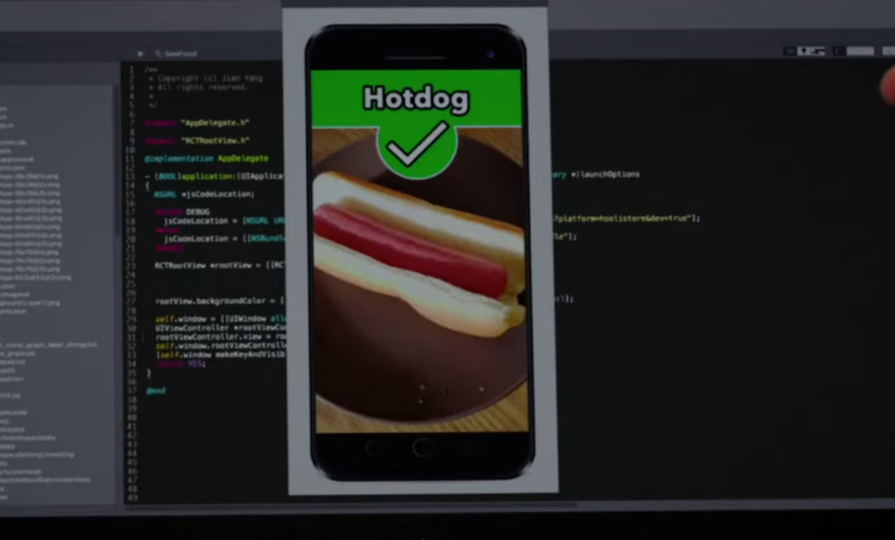
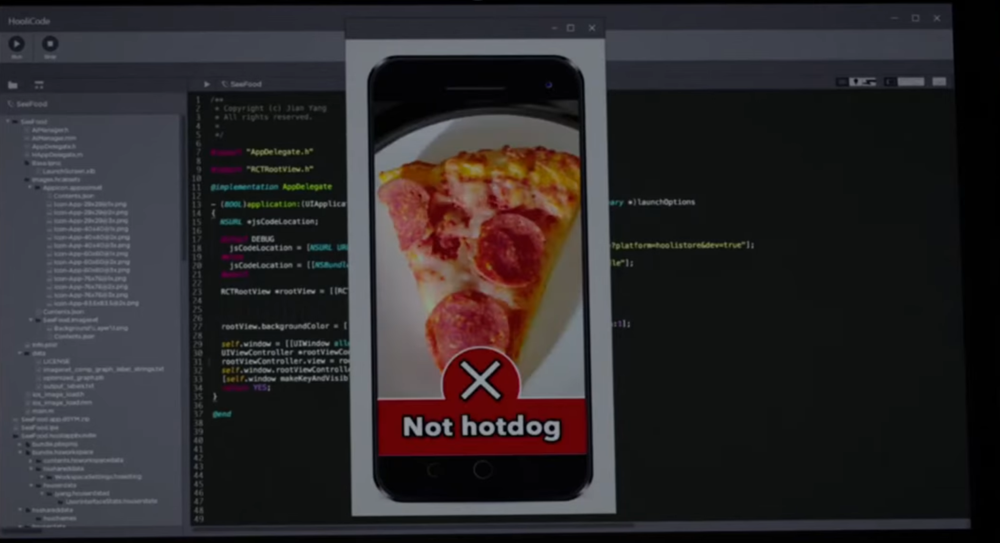

# SeeFood - AI Image Classifier 🌭

A computer vision project inspired by the **SeeFood** app from the HBO series *Silicon Valley*. The system implements a Convolutional Neural Network (CNN) leveraging transfer learning to perform binary image classification, distinguishing between "Hotdog" and "Not Hotdog" with high precision.

---

## 🎥 Inspiration

The project was inspired by the "revolutionary" **SeeFood** app developed by Jian-Yang. The goal was to take a fictional, comedic concept—a "Shazam for Food"—and implement it using a modern machine learning stack to explore the practical challenges of binary image classification and end-to-end model deployment.

> "What if I told you there is an app on the market that tell you if you have a hotdog or not a hotdog?"

  

---

## 🧠 Design

The project is designed as an end-to-end machine learning pipeline, separating data preprocessing, model architecture, and real-time inference. By leveraging **Transfer Learning**, the model utilizes pre-trained feature extractors to identify complex visual patterns in food items without requiring massive computational resources or a million-image dataset.

The architecture focuses on spatial feature extraction and dimensionality reduction, ensuring the classifier can distinguish a hotdog from visually similar items like sausages or sandwiches based on texture, geometry, and context.

[Image of Convolutional Neural Network architecture diagram]

---

## 🧭 Approach

1. **Dataset Engineering** Labeled image data was sourced from Kaggle and preprocessed using OpenCV. This included resizing images to a uniform tensor shape and normalizing pixel values for faster gradient descent convergence.

2. **Transfer Learning Strategy** Instead of training a model from scratch, the system utilizes a pre-trained backbone. By freezing the early convolutional layers—which are already optimized for detecting low-level features like edges and textures—the model focuses training on custom-added top layers. This drastically reduced training time while maintaining high feature-extraction performance.

   

3. **CNN Fine-Tuning** The custom "head" of the network consists of Global Average Pooling to reduce parameter count, followed by a dense fully-connected layer with **Sigmoid activation**. This configuration outputs a single probability score, mapping visual features to a binary classification.

4. **Inference Pipeline** A dedicated inference script was developed to bridge the gap between raw image files and the trained model. It handles real-time preprocessing—including color-space conversion and tensor expansion—to ensure input consistency during prediction.

5. **Performance Evaluation** The model was validated using accuracy and loss curves. Data augmentation techniques—such as rotation, zoom, and horizontal flipping—were applied during training to artificially expand the dataset, preventing overfitting and ensuring consistent performance across different environments.

---

## 📊 Results

The final implementation successfully recreates the core functionality of the fictional "SeeFood" app, achieving a **testing accuracy of 89%**. The system demonstrates robust classification capabilities, correctly identifying hotdogs across various lighting conditions and angles while maintaining a low false-positive rate for non-hotdog items.

The project serves as a practical demonstration of applying deep learning and computer vision techniques to solve specific image-recognition challenges in a modular, reproducible environment.

  
   

---
