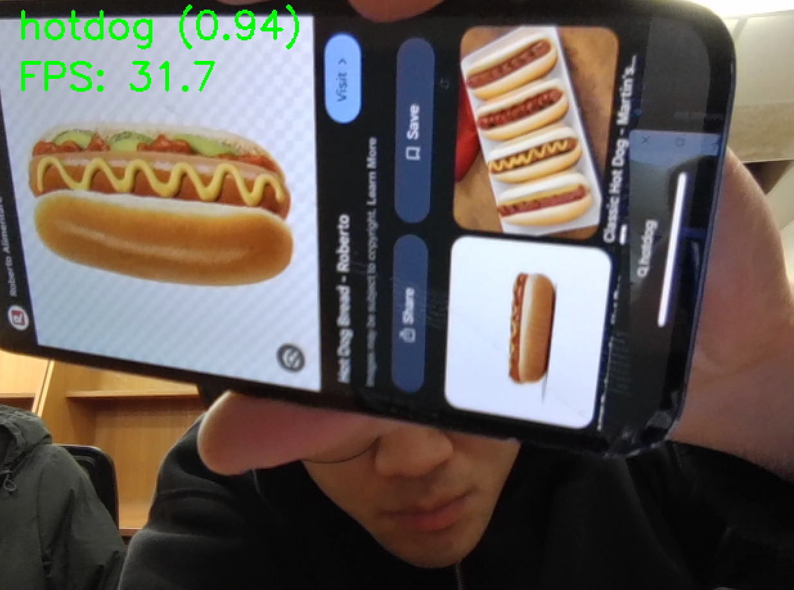
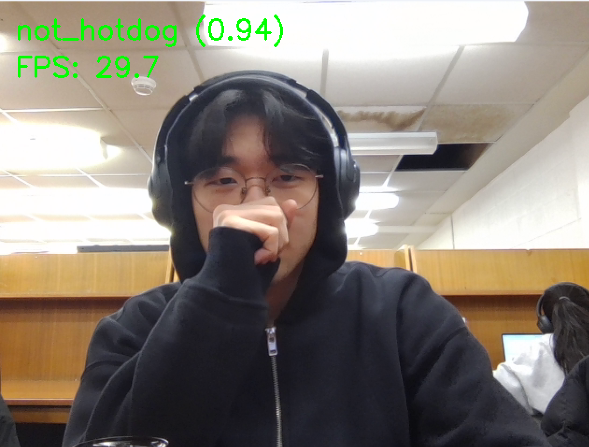
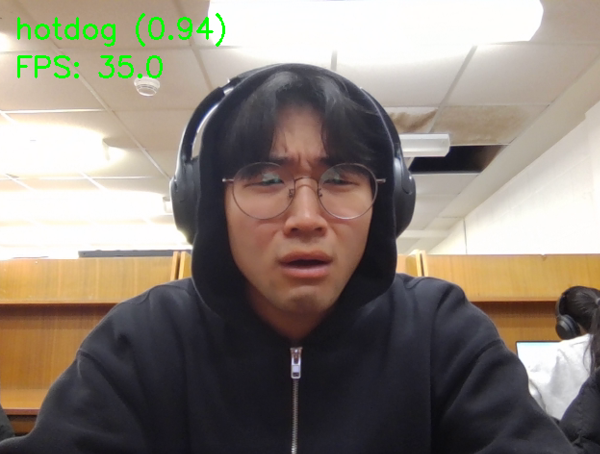

# SeeFood - AI Image Classifier 🌭

A computer vision project inspired by the **SeeFood** app from the HBO series *Silicon Valley*. The system implements a Convolutional Neural Network (CNN) leveraging transfer learning to perform binary image classification, distinguishing between "Hotdog" and "Not Hotdog."

---

## 🎥 Inspiration

The project was inspired by the "revolutionary" **SeeFood** app developed by Jian-Yang. The goal was to take a fictional, comedic concept—a "Shazam for Food"—and implement it using a modern machine learning stack to explore the practical challenges of binary image classification and end-to-end model deployment.

> "What if I told you there is an app on the market that tell you if you have a hotdog or not a hotdog?"

<a href="https://www.youtube.com/watch?v=tWwCK95X6go">

---

## 🧠 Design

The project is designed as an end-to-end machine learning pipeline, separating data preprocessing, model architecture, and real-time inference. By leveraging **Transfer Learning**, the model utilizes pre-trained feature extractors to identify complex visual patterns in food items without requiring massive computational resources or a million-image dataset.

The architecture focuses on spatial feature extraction and dimensionality reduction, ensuring the classifier can distinguish a hotdog from visually similar items like sausages or sandwiches based on texture, geometry, and context.

---

## 🧭 Approach

1. **Dataset Engineering** Labeled image data was sourced from Kaggle. During training, images were resized to a uniform tensor shape and normalized to speed up gradient descent convergence.

2. **Transfer Learning Strategy** The system utilizes a **ResNet-18** backbone. By freezing early convolutional layers—already optimized for detecting low-level features—the model focuses training on custom-added top layers, drastically reducing training time while maintaining high performance.

3. **Hybrid Inference Pipeline** A dedicated script bridges the gap between hardware and AI. **OpenCV** handles the real-time webcam stream, BGR-to-RGB color space conversion, and UI overlays, while **Torchvision** transforms handle the tensor normalization and cropping required for model input.

4. **Performance Evaluation** The model was validated using accuracy and loss curves. Data augmentation techniques—such as rotation and flipping—were applied during training to prevent overfitting and ensure consistent performance across different lighting conditions.

---

## 📊 Results

The final implementation successfully recreates the core functionality of the fictional "SeeFood" app, achieving a **testing accuracy of 89%**. The system demonstrates robust classification capabilities, correctly identifying hotdogs in real-time while maintaining a low false-positive rate for most non-food items.

### Bias & Edge Cases
During testing, an interesting edge case was identified: the model occasionally classifies human faces as "hotdogs." This is attributed to a **dataset bias**, as a significant portion of the training data featured people holding or eating hotdogs near their faces. Consequently, the model learned to associate facial features with the hotdog class.

### Future Improvements
To mitigate this bias and improve generalization, future iterations will include:
* **Negative Sampling:** Integrating a broader dataset of human faces (without hotdogs) into the "not_hotdog" class to decouple facial features from the target classification.
* **Hard Negative Mining:** Specifically training on images that the model currently misclassifies to refine the decision boundary.

---
